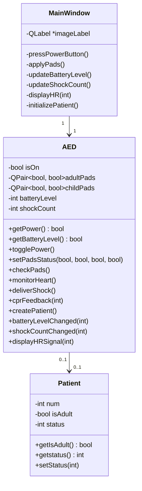

# 3004_Final_Project
AED Plus Simulation

Team Members
- Mathew Gravel-Whalen
- Kailash Balakrishnan
- Annie Zhang
- Thara Radha Palaniswamy

Task Distributions (Design)
- Use Cases: Annie
- UML Class Diagram: Mathew
- Sequence Diagrams: Thara + Annie
- State Diagrams: Thara
- Design Decisions: Kailash
- Traceability Matrix: Mathew

Task Distributions (Code)
There was a lot of collaboration on the code, especially towards the end. But the following is a rough breakdown of what each person was (broadly) responsible for.
- UI Design and Implementation: Kailash
- Basic Code Framework (Setting up header files, etc): Mathew
- AED Power ON/OFF and Self-Test: Mathew + Annie
- Electrode Pads: Mathew + Annie
- CPR Functionality: Thara
- AED Shock: Mathew + Annie
- Patient Functionality: Annie + Kailash + Mathew
- Heart Rate Display: Thara
- Final Touches: All

File Organization
The submission folder consists of two sub-directories.
 - Design Documents: Contains all design documents for this project. File names reflect the contents.
 - 3004_Final_Project: Project Source Code.
    Images folder containing visual assets for the application.
	Source & Header Files: aed.ccp/h, CPR.cpp/h, CustomDialog.cpp, mainwindow.cpp/h/ui, main.cpp, patient.cpp/h, resources.qrc and QT .pro file.

Installation, Setup and Instructions for Use.
- Open the 3004_Final_Project folder or the .pro file in QT.
- Build and Run the app in QT.
- To use:
    - Press the power button.
    - Select Adult or Child from the Combobox
    - Click on OK
    - While performing CPR:
    	- Click on the CPR buttons to adjust the CPR quality

Class Diagram

