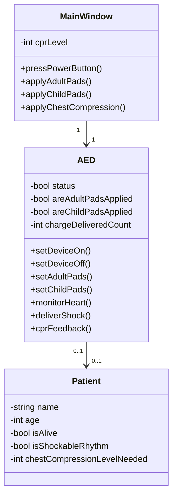

# 3004_Final_Project
AED Plus Simulation

Class Diagram

```mermaid
classDiagram
class MainWindow {
    -int cprLevel
    +pressPowerButton()
    +applyAdultPads()
    +applyChildPads()
    +applyChestCompression()
}

class AED {
    -bool status
    -bool areAdultPadsApplied
    -bool areChildPadsApplied
    -int chargeDeliveredCount
    +setDeviceOn()
    +setDeviceOff()
    +setAdultPads()
    +setChildPads()
    +monitorHeart()
    +deliverShock()
    +cprFeedback()
}

class Patient {
    -string name
    -int age
    -bool isAlive
    -bool isShockableRhythm
    -int chestCompressionLevelNeeded
}

MainWindow "1" --> "1" AED
AED "0..1" --> "0..1" Patient
```
